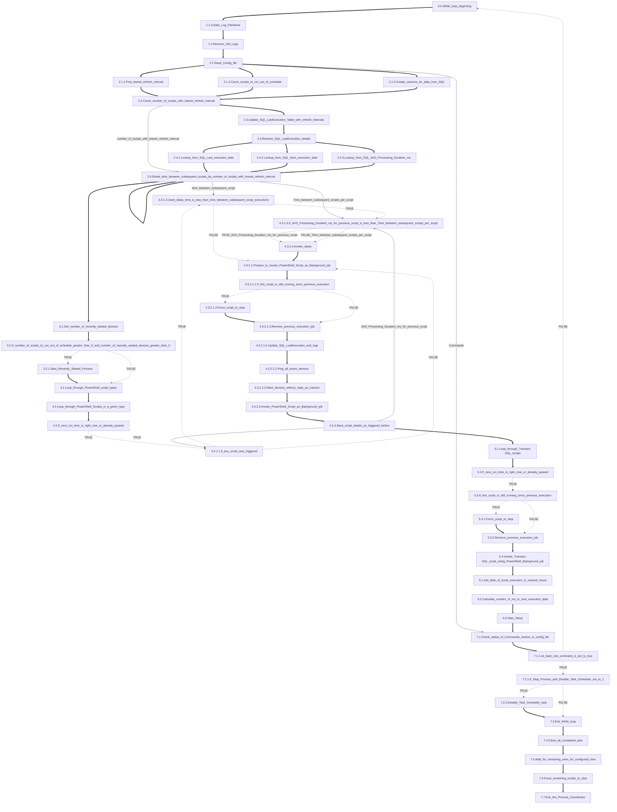

# Process Coordinator
Main process constantly running in infinite loop which starts subsequent scripts, as PowerShell Background Jobs within refresh interval time configured in Config.json 
The process involves regularly running scripts in Powershell and Transact-SQL. 
Uses SQL Device_Monitoring_Maintenance Database to store and process all information related to starting jobs, to optimize run times and reduce CPU usage spikes, by shifting scripts start times in thresholds calculated based on data from Config.json and historical data gathered in SQL Device_Monitoring_Maintenance Database. An additional mechanism has been implemented to track devices that have connected to the network recently, in order to execute, selected in config file, PowerShell scripts on them outside the schedule, to get some information or information changes as soon as possible To gracefully stop the process use commands in Config.json by changing 0 to 1, for the command which you would like to invoke.

    0.0.        While_loop_beginning - Check loop condition - if it was changed in previous iteration or not
    
    1.1.        Create_Log_FileName - Create new file name to handle date change (process can run several days)
    
    1.2.        Remove_Old_Logs - Remove outdated logs based on the number of days from which they should be kept
    
    2.1.1.      Find_lowest_refresh_interval - Find lowest refresh interval. 
                    This information is used calculate shifts between script triggers
    
    2.1.2.      Count_scripts_to_run_out_of_schedule - Check if there are any script to run out of schedule,
                    based on this information decision about running Recently started process is made
    
    2.1.3.      Create_columns_for_data_from_SQL - Create additional columns in Config variable,
                    to pull data related previous script executions stored in SQL

    2.2.        Count_number_of_scripts_with_lowest_refresh_interval - Find number of scripts with lowest refresh interval.
                    This information is used calculate shifts between script triggers. 
                    Lowest refresh interval is divided by number of scripts which have same interval time.
                    This approach is related to the fact that all scripts can require shift (especially during startup after some maintenance)

    2.3.        Update_SQL_LastExecution_Table_with_refresh_intervals - Push refresh intervals from Config.json to SQL LastExecution table

    2.4.        Retrieve_SQL_LastExecution_details - Based on the pushed data from previous step, calculate next run datetime in SQL query

    2.4.1.      Lookup_from_SQL_Last_execution_date - Insert last execution from SQL to config variable

    2.4.2.      Lookup_from_SQL_Next_execution_date - Insert next execution from SQL to config variable
    
    2.4.3.      Lookup_from_SQL_AVG_Processing_Duration_ms - Insert average processing time from SQL to config variable. 
                    Value is calculated separately for each subsequent script based on execution times for last day in similar day time

    2.5.        Divide_time_between_subsequent_scripts_by_number_of_scripts_with_lowest_refresh_interval - Calculate value described in step 2.2

    3.1.        Get_number_of_recently_started_devices - Get number of devices identified as recently connected to Network

    3.2.        If_number_of_scripts_to_run_out_of_schedule_greater_than_0_and_number_of_recently_started_devices_greater_than_0 -
                    Based on the number of recently started devices and number of scripts configured to run out of schedule,
                    decision is made if Recently started process should be started.

    3.2.1.      Start_Recently_Started_Process - If condition 3.2 is true start separate Recently Started script.

    4.1.        Loop_through_PowerShell_script_types - Foreach loop to go through all configured script types.

    4.2.        Loop_through_PowerShell_Scripts_in_a_given_type - Nested in previous loop, next foreach to go through all script in a given type.

    4.3.        If_next_run_time_is_right_now_or_already_passed - Based on a data from SQL query compare current datetime with the datetime of the next run.
                    If current datetime is greater of equal to datetime of the next run start with script invocation.

    4.3.1.1.    If_any_script_was_triggered - Check if there are any scripts run in same while loop iteration to potentially invoke shift.
                    Shift can be invoked if time dedicated for shifts during one while iteration is not exceeded.

    4.3.1.2.    Used_sleep_time_is_less_than_time_between_subsequent_script_executions - Verify condition mentioned in previous step.
                    Check if lowest refresh interval is not exceeded by already invoked shifts

    4.3.1.3.    If_AVG_Processing_Duration_ms_for_previous_script_is_less_than_Time_between_subsequent_scripts_per_script - To optimize triggering scripts.
                    Check if Average processing duration gathered from 2.4.3 step is less than time which can be used for one shift (step 2.5). If yes,
                    run the sleep for average processing duration, otherwise start sleep for max shift sleep (step 2.5)

    4.3.2.1.    Prepare_to_invoke_PowerShell_Script_as_Background_job - Invoke all steps required to start new background job without errors

    4.3.2.1.1.  If_this_script_is_still_running_since_previous_execution - Check if the same script is still running since last invocation.

    4.3.2.1.2.  Force_script_to_stop - If the previous condition is true force the script to stop.

    4.3.2.1.3.  Remove_previous_execution_job - Remove Background job dedicated for previous execution

    4.3.2.1.4.  Update_SQL_LastExecution_and_logs - Updated SQL Last execution table about exit code and last errors.

    4.3.2.2.1.  Ping_all_active_devices - Ping all active devices to check which of them are still up and running

    4.3.2.2.2.  Mark_devices_without_reply_as_inactive - mark devices not replying to ping as inactive.
                    Next execution of Get-devicesInventoryToMonitor will mark them as active if they will pass all tests.

    4.3.2.3.    Invoke_PowerShell_Script_as_Background_job - Start desired script as a background job.

    4.3.3.      Save_script_details_as_triggered_before - Update last execution datetime in SQL LastExecution table.

    5.1.        Loop_through_Transact-SQL_scripts - Similar as it was with PowerShell scripts. 
                    Go through all configured Transact-SQL scripts.

    5.2.        If_next_run_time_is_right_now_or_already_passed - Based on a data from SQL query,
                    compare current datetime with the datetime of the next run.
                If current datetime is greater of equal to datetime of the next run start with script invocation.

    5.3.        If_this_script_is_still_running_since_previous_execution - Check if the same script is still running since last invocation.
    
    5.3.1.      Force_script_to_stop - If the previous condition is true force the script to stop

    5.3.2.      Remove_previous_execution_job - Remove Background job dedicated for previous execution

    5.4.        Invoke_Transact-SQL_script_using_PowerShell_Background_job - Start desired T-SQL script as a background job.

    6.1.        Get_date_of_script_execution_in_nearest_future - Use SQL query,
                    to find the datetime of next script run in the nearest future

    6.2.        Calculate_number_of_ms_to_next_execution_date - Calculate number of milliseconds,
                    between current date time and datetime retrieved from previous step.

    6.3.        Start_Sleep - Invoke sleep for time calculated in the previous step.

    7.1.        Check_status_of_Commands_section_in_config_file - check if there are any commands invoked in Config file,
                    which are meant to stop the main loop.

    7.1.1.      At_least_one_command_is_set_to_true - If there is at least one command,
                    which is capable of exiting the main while loop
    
    7.2.1.      If_Stop_Process_and_Disable_Task_Scheduler_set_to_1 - If command "Stop_Process_and_Disable_Task_Scheduler"
                    is set to true then additional steps before exit should be taken.

    7.2.2.      Disable_Task_Scheduler_task - Disable task scheduler task

    7.3.        Exit_While_loop - change condition used in while loop to false.

    7.4.        Close_all_completed_jobs - Remove all background jobs which are already completed.

    7.5.        Wait_for_remaining_ones_for_configured_time - Wait for configured amount of time for jobs which are still running.
                    If there is any job completed, remove it.

    7.6.        Force_remaining_scripts_to_stop - If wait time is order force all remaining jobs to stop and remove them.

    7.7.        Exit_the_Process_Coordinator - exit the process.

