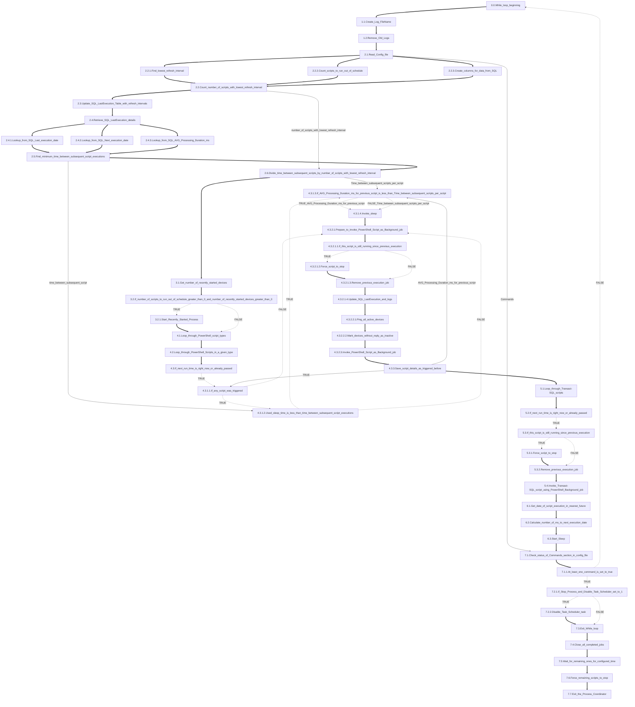

# Process Coordinator
Main process constantly running in infinite loop which starts subsequent scripts, as PowerShell Background Jobs within refresh interval time configured in Config.json 
The process involves regularly running scripts in Powershell and Transact-SQL. 
Uses SQL Device_Monitoring_Maintenance Database to store and process all information related to starting jobs, to optimize run times and reduce CPU usage spikes, by shifting scripts start times in thresholds calculated based on data from Config.json and historical data gathered in SQL Device_Monitoring_Maintenance Database. An additional mechanism has been implemented to track devices that have connected to the network recently, in order to execute, selected in config file, PowerShell scripts on them outside the schedule, to get some information or information changes as soon as possible To gracefully stop the process use commands in Config.json by changing 0 to 1, for the command which you would like to invoke.

