# MonitorWindowsDomainDevices

Open Monitoring system gathering data from Windows Domain joined devices.

Technologies used:

- **Windows Powershell** (PS Remoting for collecting data)
- **Microsoft SQL** (Collected data storage)
- **Windows Task Scheduler** (Responsible for keeping main process running)
- **Active Directory** (Access authorization to collect data)

## The main advantage of designed model is scalability and clientless.

**Scalability** - Each Powershell script can be invoked on a different Process Server which will connect to the active end-points, gather data and push it to the common for each Process Server SQL Database.

**Clientless** - You do not have to install any client or additional software on the end-point which you would like to monitor. Everything is covered by built in Windows Operating System functionalities (Some of them are disabled by default, however when it comes to the Active Directory we can use Group Policies to enable them)

End points do not require access to the SQL Server itself, so it can be hidden under separate Network / Access layer for security purposes.

# How it works

On each Process Server there is Powershell script running constantly (Process_Coordinator) (kept up by Task Scheduler), which is invoking appropriate scripts in Background jobs, according to the refresh interval defined in Config.json file and information about last execution time for particular script stored in SQL dedicated table.

In most cases when script is run as a Background job it will create next child background jobs, one for each device to take the advantage of multi cores systems and reduce execution time as well.

When all jobs which should be run at current loop iteration were started the Process_Coordinator is starting the sleep until any script requires new invocation.

```mermaid
---
displayMode: compact
---
    gantt
        dateFormat HH:mm:ss
        axisFormat %H:%M:%S
        section Main_Process
            Process_Coordinator        :des1, 00:00:00, 1m
        section Scripts
            Get-OSVersionInformation   :active, des1, 00:00:10, 20s
            Get-DeviceHardwaredetails   :crit, des1, 00:00:20, 20s
        section Background_Jobs
            PC0 :active,   des1, 00:00:11, 10s
            PC1 :active,   des1, 00:00:12, 10s
            PC2 :active,   des1, 00:00:13, 10s
            PC3 :active,   des1, 00:00:14, 10s
            PC4 :active,   des1, 00:00:15, 10s
            PC5 :active,   des1, 00:00:16, 10s
            PC6 :active,   des1, 00:00:17, 10s
            PC7 :active,   des1, 00:00:18, 10s
            PC8 :active,   des1, 00:00:19, 10s
            PC9 :active,   des1, 00:00:20, 10s
            PC0 :crit,   des1, 00:00:22, 10s
            PC1 :crit,   des1, 00:00:23, 10s
            PC2 :crit,   des1, 00:00:24, 10s
            PC3 :crit,   des1, 00:00:25, 10s
            PC4 :crit,   des1, 00:00:26, 10s
            PC5 :crit,   des1, 00:00:27, 10s
            PC6 :crit,   des1, 00:00:28, 10s
            PC7 :crit,   des1, 00:00:29, 10s
            PC8 :crit,   des1, 00:00:30, 10s
            PC9 :crit,   des1, 00:00:31, 10s
```

# Data model

There are 2 main categories of collected data:

- **Objects** - for example list of devices, where each device has own properties such like Device model, CPU model, amount of RAM memory. Information is updated in these tables, so if you extend the the RAM memory you will be able to see only current value without the historical data.
- **Events** - for example CPU Temperature measurement. Each execution will produce new entries to the database which will tell us about the value recorded at a given time.
